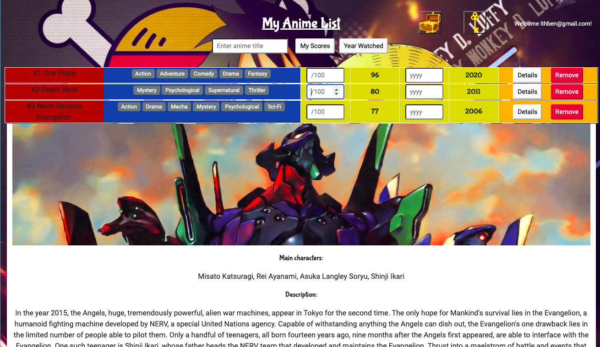

# MyAnimeList

Create your own recorded list of favourite anime!

Check out the app at the following link.

Live site URL: https://my-anime-list-gasei31.netlify.app

Steps:

- Create a user account and login
- You can start creating your own favourite anime list. Enter the anime title to retrieve information from the Anilist API.
- Optionally, you can enter your own personal score rating for each anime and record which year you watched it. The list can then be sorted by your rating or year watched.
- Toggle the details button for more information on that anime.

This project was bootstrapped with [Create React App](https://github.com/facebook/create-react-app), and uses the popular [AniList anime API](https://anilist.gitbook.io/anilist-apiv2-docs/).

# TODO:

- Popular and Trending
- Add custom anime title not in API
- Use modal for FeaturedItem
- Improve UI for user rating (e.g. stars) and year inputs (drop down menu)
- Firebase: store data [YouTube Firebase playlist](https://www.youtube.com/watch?v=2ciHixbc4HE&list=PL0vfts4VzfNj28Xp5kmNAdIqABNGhTzKF&ab_channel=Fireship)
  - Secure your data
  - Add Firebase to server?
